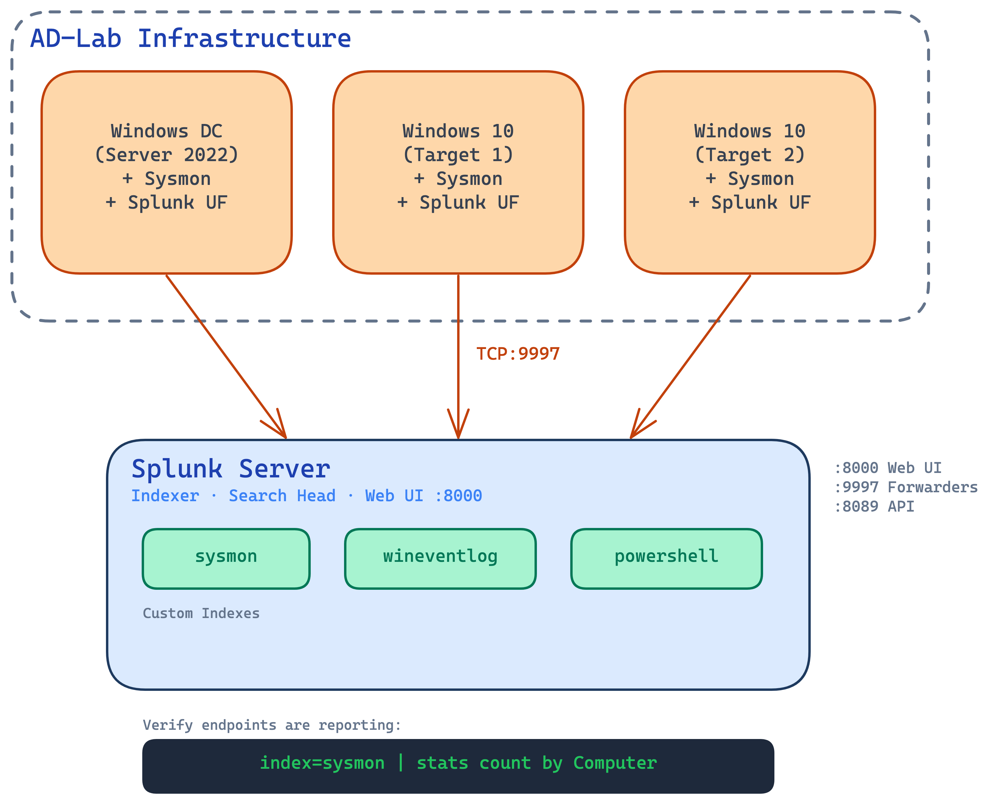
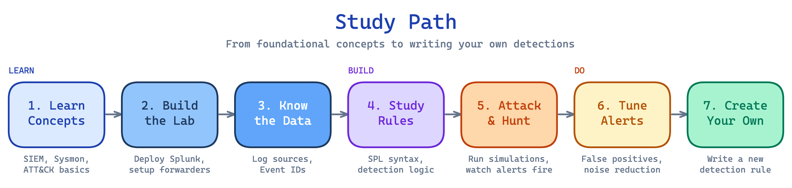

# SIEM Detection Lab

Splunk-based SIEM infrastructure for security monitoring. Automated deployment with Docker Compose, scripted forwarder setup, and a complete log ingestion pipeline from Windows endpoints.

Integrates with [AD-Lab-Setup](https://github.com/develku/AD-Lab-Setup) for endpoint infrastructure. Detection rules and attack scenarios are in their own repos — see [Related Projects](#related-projects).

## What You'll End Up With

After setup, you'll open Splunk and run `index=sysmon | stats count by Computer` — and see each of your AD-Lab machines reporting in. From there, every logon, every process, every PowerShell command, and every DNS query is a search away. The detection rules and attack simulations in the companion repos build on top of this data.

## Architecture



## What's Inside

- **One-command Splunk deployment** — `docker compose up -d` gives you a working SIEM in ~2 minutes, with three custom indexes pre-configured for Sysmon, Windows Security, and PowerShell logs
- **Scripted forwarder setup** — A PowerShell script installs and configures the Universal Forwarder on each Windows endpoint, routing 5 log channels to the correct Splunk indexes
- **30+ Windows Event IDs ingested** — Sysmon process/network/registry telemetry, Security authentication events, System service events, and PowerShell Script Block logs
- **Two deployment paths** — Docker Compose for fast setup on any OS, or manual install on Ubuntu for learning Linux administration

## Quick Start

### Prerequisites

- [AD-Lab-Setup](https://github.com/develku/AD-Lab-Setup) deployed (DC + workstations with Sysmon)
- **Docker Compose** (recommended) or **Ubuntu Server VM** for Splunk — see [Setup Guide](docs/01-Splunk-Setup.md)

### Step 1: Deploy Splunk Server

**Option A: Docker Compose (recommended — works on any OS/architecture)**

```bash
cp .env.example .env          # Edit .env to set your password
docker compose up -d           # Start Splunk (1 command, ~2 minutes)
```

**Option B: Manual Install (Ubuntu Server)**

```bash
sudo SPLUNK_ADMIN_PASSWORD='YourPassword' ./setup/01-Install-Splunk.sh
sudo ./setup/02-Configure-Inputs.sh
```

See [01-Splunk-Setup.md](docs/01-Splunk-Setup.md) for detailed instructions on both methods.

### Step 2: Deploy Forwarders on Windows Endpoints

```powershell
# On each Windows VM in the AD-Lab (run as Administrator)
.\setup\03-Deploy-Forwarder.ps1 -SplunkServerIP "192.168.10.10" -InstallerPath ".\splunkforwarder.msi"
```

### Step 3: Verify Log Ingestion

1. Open Splunk Web at `http://localhost:8000` (Docker) or `http://<splunk-server>:8000` (manual)
2. Run `index=sysmon | stats count by Computer` to verify endpoints are reporting
3. Check [Log Sources](docs/02-Log-Sources.md) for verification queries per log type

### Next Steps

Once the infrastructure is running:

- Load detection rules from [Detection-Engineering-Lab](https://github.com/develku/Detection-Engineering-Lab)
- Run attack scenarios from [Attack-Simulation-Lab](https://github.com/develku/Attack-Simulation-Lab)

## Study Path (For Learners)



| Step | What To Do | Guide |
|---|---|---|
| 1 | **Learn the concepts** — Understand what a SIEM is, how Sysmon works, what MITRE ATT&CK means | [Learning Guide](docs/00-Learning-Guide.md) + [Glossary](docs/GLOSSARY.md) |
| 2 | **Build the lab** — Deploy Splunk, configure forwarders, verify log ingestion | [Splunk Setup](docs/01-Splunk-Setup.md) |
| 3 | **Know the data** — Study each log source, learn critical Event IDs | [Log Sources](docs/02-Log-Sources.md) |
| 4 | **Study detection rules** — Read each rule, understand SPL syntax and what it catches | [Detection-Engineering-Lab](https://github.com/develku/Detection-Engineering-Lab) |
| 5 | **Attack and hunt** — Execute scenarios, watch alerts fire, practice investigation | [Attack-Simulation-Lab](https://github.com/develku/Attack-Simulation-Lab) |
| 6 | **Tune alerts** — Read tuning reports, understand false positives, reduce noise | [Detection-Engineering-Lab — Tuning](https://github.com/develku/Detection-Engineering-Lab/tree/main/tuning) |
| 7 | **Create your own** — Write a detection rule for a technique not yet covered | [MITRE ATT&CK](https://attack.mitre.org/) |

## Documentation

| Guide | Description |
|---|---|
| [Learning Guide](docs/00-Learning-Guide.md) | Start here — foundational concepts explained for beginners |
| [Glossary](docs/GLOSSARY.md) | SOC/SIEM terminology reference |
| [Splunk Setup](docs/01-Splunk-Setup.md) | Server installation, configuration, and troubleshooting |
| [Log Sources](docs/02-Log-Sources.md) | What logs are ingested, critical event IDs, verification queries |

## Project Structure

```
SIEM-Detection-Lab/
├── README.md                           # This file
├── docker-compose.yml                  # Splunk Docker deployment
├── .env.example                        # Environment variable template
├── attachments/                        # Screenshots and images
├── configs/                            # Splunk configuration files
│   ├── outputs.conf                    # Forwarder output config
│   └── siem-lab/                       # Splunk app configs
│       └── local/
│           ├── indexes.conf            # Custom index definitions
│           ├── inputs.conf             # Data input configuration
│           ├── props.conf              # Field extraction rules
│           └── transforms.conf         # Field transformation rules
├── setup/                              # Deployment scripts
│   ├── 01-Install-Splunk.sh           # Splunk server setup (Ubuntu)
│   ├── 02-Configure-Inputs.sh         # Index and input configuration
│   └── 03-Deploy-Forwarder.ps1        # Splunk UF for Windows endpoints
└── docs/                               # Setup guides and methodology
    ├── 00-Learning-Guide.md
    ├── 01-Splunk-Setup.md
    ├── 02-Log-Sources.md
    └── GLOSSARY.md
```

## Related Projects

This lab is part of a multi-project SOC environment:

| Project | Purpose |
|---|---|
| [AD-Lab-Setup](https://github.com/develku/AD-Lab-Setup) | Windows Active Directory infrastructure |
| **SIEM-Detection-Lab** (this repo) | Splunk SIEM deployment and log collection |
| [Detection-Engineering-Lab](https://github.com/develku/Detection-Engineering-Lab) | Detection rules, dashboards, and tuning |
| [Attack-Simulation-Lab](https://github.com/develku/Attack-Simulation-Lab) | Adversary emulation and attack validation |
