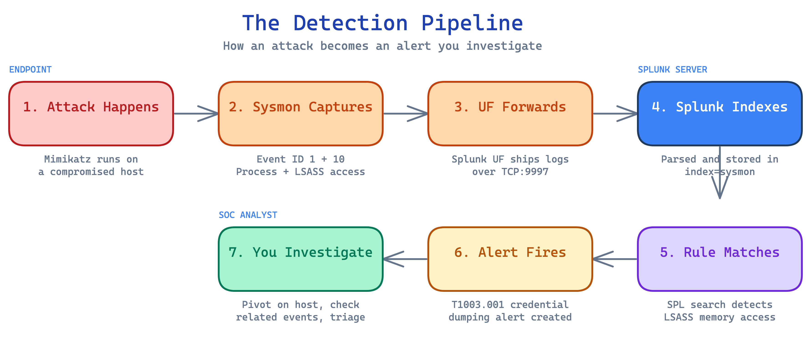

# Learning Guide

Welcome to the SIEM Detection Lab. This guide is written for anyone starting their journey into security operations — whether you're changing careers, studying for a SOC analyst role, or just curious about how security monitoring actually works. No prior SIEM experience needed.

By the end of this guide, you'll understand how all the pieces of a security monitoring pipeline fit together and have a clear path for working through this lab.

---

## What is a SIEM?

A **SIEM** (Security Information and Event Management, pronounced "sim") is software that collects logs from across your network, correlates them, detects suspicious activity, and alerts your security team.

Think of it like a **security camera system for your entire network**. Individual cameras (log sources) capture what's happening at specific locations — the front door, the server room, the parking lot. The SIEM is the monitoring station where all those camera feeds come together on one screen. A security guard (you, the SOC analyst) watches the feeds, and the system can automatically flag unusual activity — someone entering through a window at 3 AM, for example.

A SIEM does four core things:

1. **Collects logs** — gathers event data from servers, endpoints, firewalls, applications, and more
2. **Normalizes and indexes** — organizes all that data so you can search it quickly
3. **Correlates events** — connects related events across different sources (a failed login on the firewall + a successful login on a server + a new admin account = suspicious pattern)
4. **Detects and alerts** — runs detection rules that fire alerts when known attack patterns appear

Every SOC (Security Operations Center) runs a SIEM. It's the primary tool analysts use every day. Splunk, Microsoft Sentinel, Elastic Security, IBM QRadar, and Google Chronicle are some of the big names. This lab uses **Splunk Free** because it's accessible, widely used in the industry, and the SPL query language is a valuable skill on any SOC analyst resume.

---

## What is Sysmon?

**Sysmon** (System Monitor) is a free tool from Microsoft's Sysinternals suite that dramatically extends what Windows logs. It runs as a service and records detailed telemetry about system activity into the Windows Event Log.

### What native Windows logging misses

Out of the box, Windows Security logs tell you the basics: someone logged in, a process started, an account was created. But they leave out crucial details that security analysts need. For example, native logging can tell you that `cmd.exe` ran, but not _what command was typed_. It can tell you a network connection was made, but not _which process made it_.

### What Sysmon adds

Sysmon fills those gaps with rich, detailed events:

| Capability | Why It Matters |
|---|---|
| **Process creation with full command lines** | See exactly what was executed, not just the program name |
| **Parent-child process relationships** | Know that `powershell.exe` was launched by `excel.exe` (suspicious!) |
| **Network connections with process context** | See which process called out to a suspicious IP address |
| **DNS queries per process** | Know that `rundll32.exe` resolved a strange domain |
| **File creation tracking** | See what files were dropped and by which process |
| **Registry modifications** | Detect persistence mechanisms being installed |
| **DLL loading events** | Catch DLL injection and side-loading attacks |
| **Process access events** | Detect credential dumping tools touching LSASS memory |

### The analogy

If **Windows Event Log is a security camera at the front door** — it tells you someone entered the building — then **Sysmon is cameras in every room** — it tells you where they went, what they touched, who they talked to, and what they carried out.

Sysmon is the **number one tool for endpoint visibility** in a Windows environment. Nearly every detection rule in this lab relies on Sysmon data, because without it, we simply can't see enough to detect most attacks.

---

## How Do Detection Rules Work?

A detection rule is, at its core, **pattern matching on log data**. You define a pattern that looks suspicious, and when a log entry matches that pattern, the rule fires an alert.

### The spam filter analogy

You already know how detection rules work — you just call them spam filters. Your email spam filter looks for patterns: messages from unknown senders with "URGENT" in the subject line containing a suspicious link. A SIEM detection rule does the same thing, but instead of scanning emails, it scans security logs for patterns that match known attack techniques.

### Structure of a detection rule

Every detection rule has three parts:

1. **Data source** — Where to look. Which logs, which index, which event type?
2. **Condition** — What to look for. What specific pattern indicates something malicious?
3. **Action** — What to do when matched. Fire an alert? Create an incident? Send an email?

For example, this lab's LSASS memory dump detection works like this:

| Component | Value |
|---|---|
| **Data source** | Sysmon logs (index=sysmon), Process Access events (EventCode=10) |
| **Condition** | Any process that opens a handle to `lsass.exe` with specific access flags used by dumping tools |
| **Action** | Alert — potential credential theft in progress |

### Why false positives happen

Not every match is a real attack. Legitimate software sometimes behaves in ways that look suspicious to a detection rule. Antivirus software accesses LSASS memory as part of its normal operation. IT admin tools create remote services that look like lateral movement. Backup software touches sensitive registry keys.

This is why **tuning** matters. Tuning means refining your detection rules to reduce false alerts while keeping the ability to catch real attacks. It's one of the most important (and underrated) skills a SOC analyst develops. This lab includes a dedicated [tuning methodology](https://github.com/develku/Detection-Engineering-Lab/blob/main/docs/tuning-methodology.md) and real tuning reports in the [Detection-Engineering-Lab](https://github.com/develku/Detection-Engineering-Lab/tree/main/tuning).

### SPL basics

**SPL** (Search Processing Language) is Splunk's query language. Every detection rule in this lab is written in SPL. Here are the building blocks you'll need:

| SPL Concept | What It Does | Example |
|---|---|---|
| `index=` | Selects which data store to search | `index=sysmon` |
| `sourcetype=` | Filters by log type | `sourcetype=XmlWinEventLog` |
| `EventCode=` | Filters by Windows Event ID | `EventCode=10` |
| `\|` (pipe) | Sends results from one command to the next | `index=sysmon \| stats count by Image` |
| `stats` | Aggregates results (count, sum, values) | `stats count by src_ip, dest_ip` |
| `where` | Filters results based on conditions | `where count > 5` |
| `table` | Formats output as a clean table | `table _time, Image, CommandLine` |
| `eval` | Creates or transforms fields | `eval status=if(count>10,"high","low")` |
| `rex` | Extracts fields using regex | `rex field=CommandLine "(?<target>\w+\.exe)"` |

A simple SPL query reads left to right: start with your data source, filter it down, transform it, and display the results.

```spl
index=sysmon EventCode=1 Image="*mimikatz*"
| stats count by Computer, User, CommandLine
| where count > 0
| table Computer, User, CommandLine, count
```

This query says: "In the Sysmon logs, find all process creation events where the executable name contains 'mimikatz,' count them per computer/user/command, and show me a table of results."

---

## What is MITRE ATT&CK?

**MITRE ATT&CK** (Adversarial Tactics, Techniques, and Common Knowledge) is a knowledge base that catalogs how real-world attackers actually operate. It's maintained by MITRE, a nonprofit research organization, and it's become the shared language of the cybersecurity industry.

### The framework explained simply

Imagine a cookbook, but instead of recipes for food, it contains recipes for cyberattacks — documented from real incidents. ATT&CK organizes everything attackers do into a structured framework so defenders can systematically understand, detect, and respond to threats.

### Tactics vs Techniques

| Concept | Meaning | Question It Answers | Example |
|---|---|---|---|
| **Tactic** | A goal the attacker wants to achieve | "Why are they doing this?" | Credential Access — the attacker wants to steal passwords |
| **Technique** | A specific method to achieve that goal | "How are they doing it?" | OS Credential Dumping (T1003) — dumping passwords from LSASS memory |
| **Sub-technique** | A more specific variation | "Exactly how?" | LSASS Memory (T1003.001) — using Mimikatz to dump LSASS |

The ATT&CK matrix is organized as **columns (tactics)** and **rows (techniques)**. An attack typically moves left to right across the matrix: Initial Access, then Execution, then Persistence, Privilege Escalation, Defense Evasion, and so on.

### Why SOC teams map everything to ATT&CK

- **Common language** — when you say "T1003.001," every security professional in the world knows you mean LSASS credential dumping
- **Coverage mapping** — you can see which attack techniques your detections cover and where you have gaps
- **Prioritization** — you can focus on the techniques that real threat groups actually use against organizations like yours
- **Communication** — incident reports and threat intelligence use ATT&CK IDs as a shared reference

### How to read an ATT&CK technique page

When you visit a technique page (like [T1003 - OS Credential Dumping](https://attack.mitre.org/techniques/T1003/)), you'll find:

1. **Description** — what the technique does and why attackers use it
2. **Sub-techniques** — more specific variations
3. **Procedure examples** — real threat groups that have used this technique
4. **Mitigations** — how to prevent or limit the technique
5. **Detection** — what to look for in your logs (this is gold for writing detection rules)

Bookmark this: [https://attack.mitre.org](https://attack.mitre.org)

Every detection rule in this lab is mapped to its ATT&CK technique, so you can cross-reference and learn the framework as you go.

---

## What is Sigma?

**Sigma** is an open, vendor-neutral format for writing detection rules. If you write a detection rule in Sigma format, it can be automatically converted into the query language of any major SIEM — Splunk SPL, Microsoft KQL, Elastic Query DSL, and more.

### The analogy

Think of Sigma like **HTML for detection rules**. You write a web page in HTML once, and any browser (Chrome, Firefox, Safari) can display it. Similarly, you write a detection rule in Sigma once, and any SIEM can run it. The Sigma community maintains converters (called "backends") that translate Sigma rules into each SIEM's native language.

### Why Sigma matters for your career

- **Portability** — learn Sigma and you can work with _any_ SIEM, not just Splunk
- **Community** — thousands of community-contributed Sigma rules cover known attack techniques. The [SigmaHQ repository](https://github.com/SigmaHQ/sigma) on GitHub is a massive library of detections you can deploy immediately.
- **Standardization** — more and more security teams write their detections in Sigma first, then convert to their SIEM's format
- **Job relevance** — Sigma knowledge is increasingly listed on SOC analyst job postings

### Sigma in this lab

The [Detection-Engineering-Lab](https://github.com/develku/Detection-Engineering-Lab) includes Sigma versions of its detection rules in the [`sigma/`](https://github.com/develku/Detection-Engineering-Lab/tree/main/sigma) directory. Each `.yml` file is a Sigma rule that corresponds to an `.spl` file in the [`detections/`](https://github.com/develku/Detection-Engineering-Lab/tree/main/detections) directory. Studying both side by side is a great way to learn how the two formats relate.

---

## How Does This Lab Fit Together?

Here's the big picture — how data flows from an attack to an alert:



### Which component handles what

| Component | Role | Where in this lab |
|---|---|---|
| **Sysmon** | Captures detailed endpoint telemetry | Configured on AD-Lab Windows machines |
| **Splunk Universal Forwarder** | Ships logs from endpoints to Splunk | Installed on each AD-Lab endpoint |
| **Splunk Server** | Indexes logs, runs searches, fires alerts | Ubuntu VM ([setup guide](01-Splunk-Setup.md)) |
| **Detection Rules (SPL)** | Define what suspicious activity looks like | [Detection-Engineering-Lab](https://github.com/develku/Detection-Engineering-Lab/tree/main/detections) |
| **Sigma Rules** | Vendor-neutral versions of detection rules | [Detection-Engineering-Lab](https://github.com/develku/Detection-Engineering-Lab/tree/main/sigma) |
| **Dashboards** | Visual overview of security posture | [Detection-Engineering-Lab](https://github.com/develku/Detection-Engineering-Lab/tree/main/dashboards) |
| **Attack Simulations** | Controlled attacks to test detections | [Attack-Simulation-Lab](https://github.com/develku/Attack-Simulation-Lab/tree/main/simulations) |
| **Tuning Reports** | Document and reduce false positives | [Detection-Engineering-Lab](https://github.com/develku/Detection-Engineering-Lab/tree/main/tuning) |

---

## Study Path (Recommended Order)

Work through these in order. Each step builds on the previous one.

### Step 1: Build your foundation

Read this Learning Guide and the [Glossary](GLOSSARY.md). Don't worry about memorizing everything — you'll come back to these as reference material.

### Step 2: Set up Splunk

Follow [01-Splunk-Setup.md](01-Splunk-Setup.md) to deploy Splunk on an Ubuntu VM and connect it to your AD-Lab endpoints. This gives you a working SIEM to explore.

### Step 3: Understand your log sources

Study [02-Log-Sources.md](02-Log-Sources.md) carefully. Pay special attention to the **Event IDs** — these are the building blocks of every detection rule. Knowing what Event ID 1 vs 10 vs 4624 vs 4688 means will come up constantly.

### Step 4: Study the detection rules

Read through the [Detection Rules guide](https://github.com/develku/Detection-Engineering-Lab/blob/main/docs/detection-rules.md), then open each `.spl` file in the [detections/](https://github.com/develku/Detection-Engineering-Lab/tree/main/detections) directory. For each rule, ask yourself:

- What attack does this detect?
- Which log source and Event ID does it use?
- What would a true positive look like? A false positive?
- What ATT&CK technique does it map to?

### Step 5: Run attack simulations

Start with [Credential Dumping](https://github.com/develku/Attack-Simulation-Lab/blob/main/simulations/01-credential-dumping.md). Run the controlled attack, then switch to Splunk and watch the alerts fire. This is where theory becomes real. You'll see exactly how an attack looks in log data.

### Step 6: Practice investigation

After each simulation, use the SPL queries provided in the simulation docs to investigate the activity. Practice pivoting: start from an alert, find the source host, look at what else happened on that host, trace the attacker's steps. This is the core skill of a SOC analyst.

### Step 7: Study tuning reports

Read the tuning reports in the [Detection-Engineering-Lab tuning/](https://github.com/develku/Detection-Engineering-Lab/tree/main/tuning) directory. Understand why false positives happened, how the rules were refined, and what the impact was. Being able to tune detection rules is what separates a junior analyst from an experienced one.

### Step 8: Write your own detection

Pick a MITRE ATT&CK technique not already covered in this lab. Research it, figure out what log events it would generate, write an SPL detection rule, create a Sigma version, and test it with a simulation. This is the ultimate test of your understanding.

---

## Recommended External Resources

These free and paid resources pair well with this lab:

### Hands-on training platforms

- **[TryHackMe SOC Level 1](https://tryhackme.com/path/outline/soclevel1)** — structured learning path covering SIEM, log analysis, and incident response
- **[LetsDefend](https://letsdefend.io/)** — SOC analyst training with realistic alert triage exercises
- **[CyberDefenders](https://cyberdefenders.org/)** — blue team challenges using real-world PCAP and log datasets

### Splunk-specific

- **[Splunk Fundamentals 1](https://www.splunk.com/en_us/training/courses/splunk-fundamentals-1.html)** — free official course covering SPL basics, searching, and reporting
- **[Splunk BOTS (Boss of the SOC)](https://bots.splunk.com/)** — CTF-style challenges focused on security analysis in Splunk

### MITRE ATT&CK

- **[ATT&CK Navigator](https://mitre-attack.github.io/attack-navigator/)** — interactive tool for visualizing detection coverage
- **[ATT&CK website](https://attack.mitre.org/)** — the full framework with technique descriptions, real-world examples, and detection guidance

### Detection engineering

- **[Sigma Rules Repository](https://github.com/SigmaHQ/sigma)** — community-maintained library of detection rules
- **[Uncoder.IO](https://uncoder.io/)** — online tool to translate between Sigma, SPL, KQL, and other SIEM languages

---

Your next step: open [01-Splunk-Setup.md](01-Splunk-Setup.md) and deploy your SIEM. Once Splunk is running and ingesting logs, come back to this guide's Study Path (Step 4 onward) and start reading detection rules against live data. Understanding _why_ a detection works matters more than memorizing SPL syntax — and having real logs to query makes the difference.
