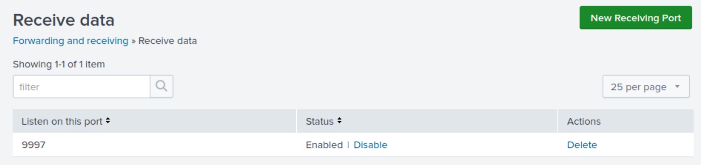
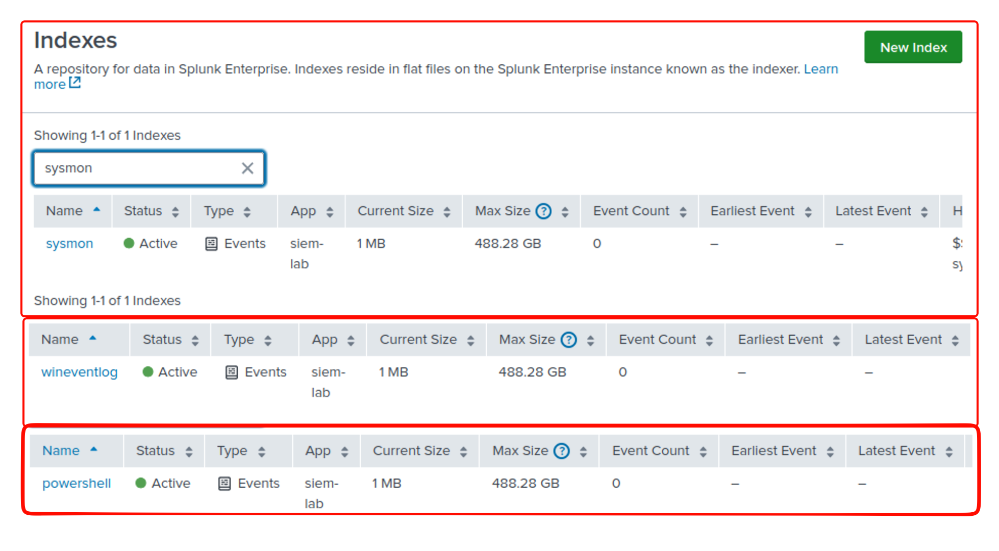
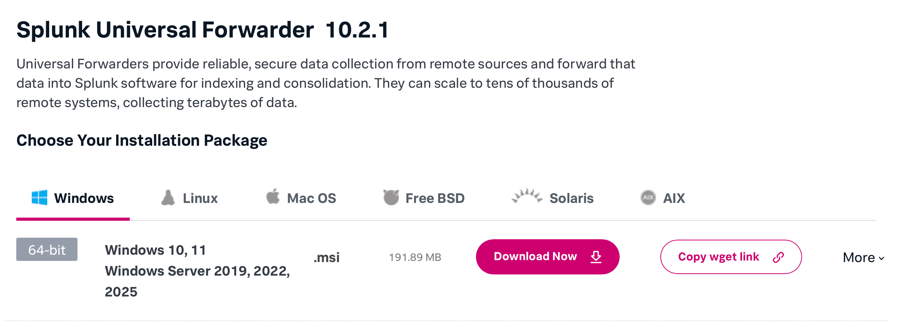
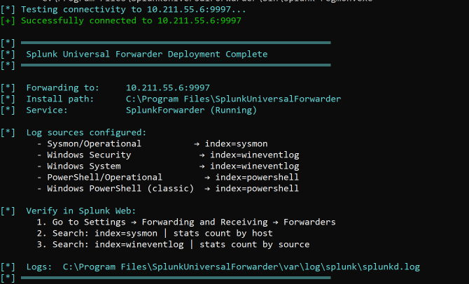

# Splunk Server Setup

After completing this guide, you'll have:

- **Splunk Web UI** running at `http://localhost:8000` (or your VM's IP)
- **Three custom indexes** — `sysmon`, `wineventlog`, `powershell` — receiving forwarded logs
- **Universal Forwarders** on your AD-Lab Windows endpoints shipping Sysmon, Security, System, and PowerShell logs to Splunk over TCP port 9997
- Detection-ready infrastructure for the rules in [Detection-Engineering-Lab](https://github.com/develku/Detection-Engineering-Lab)

> **What is Splunk Free?** Splunk Enterprise running without a paid license. It provides the same search engine, indexing, and SPL query language as the full product. The main limitations: **500 MB/day indexing cap** (plenty for a home lab with a few endpoints), no built-in alerting (you run saved searches manually or on a schedule), and no role-based access control beyond the single admin account. For learning SIEM operations, these limitations don't matter — the search and analysis experience is identical to what SOC teams use in production.

Two installation methods are provided:

| Method | Best For | Setup Time | Pros |
|---|---|---|---|
| **Docker Compose** (recommended) | Any OS (Linux, macOS, Windows) | ~2 minutes | One-command setup, easy cleanup, works on Apple Silicon via emulation |
| **Manual Install** | Learning Linux admin, or when Docker isn't available | ~30 minutes | Teaches traditional sysadmin, closer to production enterprise setups |

> **Which should I choose?** If you're on Apple Silicon (M-series Mac) or want the fastest setup, use Docker Compose. If you want to practice Linux system administration or understand what's happening under the hood, use manual install. You can always switch later.

## Architecture

```
AD-Lab Endpoints (Windows)         Splunk Server
┌─────────────────────┐           ┌─────────────────────────┐
│ Sysmon + WEF        │           │ Splunk Free              │
│ Splunk UF           │──TCP:9997──▶│ Indexer + Search         │
│ (forwards logs)     │           │ Web UI: :8000            │
└─────────────────────┘           │ (Docker or bare metal)   │
                                  └─────────────────────────┘
```

### Network Requirements

Ensure these ports are open on the Splunk server before starting setup:

| Port | Protocol | Direction | Purpose |
|---|---|---|---|
| 8000 | TCP | Inbound | Splunk Web UI (your browser) |
| 9997 | TCP | Inbound | Forwarder data receiving (Windows endpoints → Splunk) |
| 8089 | TCP | Inbound | Splunk management API (optional for basic lab use) |

**Official documentation references:**

- [Splunk Enterprise Install Guide](https://docs.splunk.com/Documentation/Splunk/latest/Installation) — full installation and configuration reference
- [Splunk Docker image docs](https://splunk.github.io/docker-splunk/) — environment variables, volume mounts, and container configuration
- [Splunk Universal Forwarder Manual](https://docs.splunk.com/Documentation/Forwarder/latest/Forwarder) — forwarder deployment, inputs, and outputs
- [Sysmon documentation](https://learn.microsoft.com/en-us/sysinternals/downloads/sysmon) — installation, configuration, and event schema

---

## Option A: Docker Compose (Recommended)

> **What is Docker Compose?** It's a tool that defines multi-container applications in a single YAML file. Instead of installing Splunk manually (downloading packages, creating users, configuring services), you describe what you want and Docker builds it. Think of it as a recipe — you write it once, and anyone can reproduce the same dish.

### Prerequisites

- **Docker Engine + Docker Compose** installed (see Step A0 below)
- At least **4GB RAM** available
- Network connectivity to AD-Lab endpoints

> **Apple Silicon (M-series Mac) note:** The official Splunk Docker image is **amd64-only** — Splunk has not released native ARM64 builds. The `docker-compose.yml` includes `platform: linux/amd64` so Docker Desktop automatically uses Rosetta 2 emulation. This works but runs ~2x slower than native. For a home lab this is fine — search performance is still adequate for the data volumes we generate. If you're on Intel/AMD, the image runs natively with no emulation overhead.

### Step A0: Install Docker

Docker is not pre-installed on most Linux distributions. Follow the steps below for your OS.

**Official Docker installation docs:** [https://docs.docker.com/engine/install/](https://docs.docker.com/engine/install/)

> [!TIP]
> **Official repo vs `apt install docker.io`:** The Ubuntu default `docker.io` package is often outdated. By adding Docker's official GPG key and repository (as shown below), you always get the latest stable version with the Compose plugin built-in. The `docker-compose-plugin` package gives you `docker compose` (v2) instead of the old `docker-compose` (v1) — v2 is faster and better maintained.

#### Ubuntu / Debian

These steps are from the [official Docker documentation](https://docs.docker.com/engine/install/ubuntu/).

```bash
# 1. Remove any old/conflicting Docker packages
sudo apt remove docker.io docker-compose docker-compose-v2 docker-doc podman-docker containerd runc 2>/dev/null

# 2. Install prerequisites and add Docker's official GPG key
sudo apt update
sudo apt install -y ca-certificates curl
sudo install -m 0755 -d /etc/apt/keyrings
sudo curl -fsSL https://download.docker.com/linux/ubuntu/gpg -o /etc/apt/keyrings/docker.asc
sudo chmod a+r /etc/apt/keyrings/docker.asc

# 3. Add Docker's official repository (DEB822 format)
sudo tee /etc/apt/sources.list.d/docker.sources <<EOF
Types: deb
URIs: https://download.docker.com/linux/ubuntu
Suites: $(. /etc/os-release && echo "${UBUNTU_CODENAME:-$VERSION_CODENAME}")
Components: stable
Signed-By: /etc/apt/keyrings/docker.asc
EOF

# 4. Install Docker Engine + Compose plugin
sudo apt update
sudo apt install -y docker-ce docker-ce-cli containerd.io docker-buildx-plugin docker-compose-plugin

# 5. Add your user to the docker group (so you don't need sudo for every docker command)
sudo usermod -aG docker $USER

# 6. IMPORTANT: Log out and log back in for the group change to take effect
#    If using SSH: exit and reconnect
#    If on a desktop: log out and log in
```

> [!TIP]
> **Why add your user to the `docker` group?** By default, Docker commands require `sudo`. Adding your user to the `docker` group lets you run `docker compose up -d` without `sudo`. This is standard practice for development/lab machines. In production, you'd use more restrictive access controls.

#### macOS

Install **Docker Desktop** from [docker.com/products/docker-desktop](https://www.docker.com/products/docker-desktop/). It includes Docker Engine and Compose.

After installing, open Docker Desktop and ensure it's running (whale icon in menu bar). Go to **Settings → Resources** and allocate at least **4GB RAM**.

#### Windows

Install **Docker Desktop** from [docker.com/products/docker-desktop](https://www.docker.com/products/docker-desktop/). Enable **WSL 2** backend when prompted.

#### Verify Docker is Working

```bash
# Check Docker Engine is running
docker --version
# Expected: Docker version 27.x.x or similar

# Check Docker Compose is available
docker compose version
# Expected: Docker Compose version v2.x.x

# Run a quick test (downloads a tiny test image)
docker run --rm hello-world
# Expected: "Hello from Docker!" message
```

> **Troubleshooting:** If `docker` commands fail with "permission denied", you either need to log out and back in (after Step 5 above), or prefix commands with `sudo`.

### Step A1: Set Up the Deployment Directory

Create a directory on your Splunk server (name it anything you like) with this structure:

```
~/splunk-lab/              ← name this whatever you want
├── docker-compose.yml     ← from this repo's root
├── .env                   ← your password (created from .env.example)
└── configs/
    └── siem-lab/          ← mounted as a Splunk app
        ├── app.conf       ← app metadata (name, version)
        └── local/         ← Splunk reads custom configs from here
            ├── inputs.conf
            ├── props.conf
            ├── transforms.conf
            └── indexes.conf
```

> **Why a Splunk app instead of individual files?** The Splunk Docker image uses Ansible to provision configs at startup. Ansible does atomic file renames, which fail on Docker bind-mounted files (`EBUSY: Device or resource busy`). Mounting a directory as a Splunk app avoids this entirely — Ansible doesn't touch app directories, and Splunk merges app configs on top of system defaults automatically. This is also Splunk's recommended approach for custom configurations.

```bash
# Example: set up on an Ubuntu VM
mkdir -p ~/splunk-lab/configs

# Copy files from this repo (adjust the source path to match your setup)
# Option 1: scp from your host machine
scp docker-compose.yml .env.example user@<vm-ip>:~/splunk-lab/
scp -r configs/siem-lab user@<vm-ip>:~/splunk-lab/configs/

# Option 2: clone the repo directly on the VM
git clone https://github.com/develku/SIEM-Detection-Lab.git
cp SIEM-Detection-Lab/docker-compose.yml ~/splunk-lab/
cp SIEM-Detection-Lab/.env.example ~/splunk-lab/
cp -r SIEM-Detection-Lab/configs/siem-lab ~/splunk-lab/configs/
```

Then configure your password:

```bash
cd ~/splunk-lab
cp .env.example .env

# Edit .env and change SPLUNK_PASSWORD to your desired password
# The .env file is in .gitignore — your password won't be committed to git
```

> **Why a `.env` file?** Docker Compose reads variables from `.env` automatically. This keeps your password out of `docker-compose.yml` (which IS committed to git) and out of your shell history. In production, you'd use a secrets manager instead.

> **Why `configs/` next to `docker-compose.yml`?** Docker Compose resolves volume mount paths relative to the compose file, not to the directory you run the command from. By placing configs alongside the compose file, the deployment directory is fully self-contained — you can name it anything, move it anywhere, and the bind mounts still resolve correctly. The `configs/siem-lab/` subdirectory is structured as a Splunk app and mounted as a whole directory to `/opt/splunk/etc/apps/siem-lab` inside the container.

### Step A2: Start Splunk

```bash
# From your deployment directory (e.g., ~/splunk-lab):
docker compose up -d
```

That's it. One command. Docker will:

1. Pull the `splunk/splunk:latest` image (uses Rosetta 2 emulation on Apple Silicon)
2. Accept both the Splunk license and [Splunk General Terms](https://www.splunk.com/en_us/legal/splunk-general-terms.html) (configured in `docker-compose.yml`)
3. Mount your custom configs as a Splunk app from `configs/siem-lab/` (includes `inputs.conf`, `props.conf`, `transforms.conf`, and `indexes.conf`)
4. Expose ports 8000 (Web UI), 9997 (forwarders), and 8089 (API)
5. Create persistent volumes so your data survives container restarts

> **What does `-d` mean?** It runs the container in "detached" mode (background). Without `-d`, the terminal would show Splunk's live logs and you couldn't use it for anything else.

#### Watch the Startup

```bash
# Follow the startup logs (Ctrl+C to stop watching)
docker compose logs -f splunk
```

Splunk takes 60-90 seconds to start (3-5 minutes on Apple Silicon via Rosetta 2 emulation). Wait until you see:

```
Ansible playbook complete, will begin streaming splunkd_stderr.log
```

### Step A3: Verify

The custom indexes (`sysmon`, `wineventlog`, `powershell`) are created automatically from `indexes.conf` in the app — no manual creation needed.

1. Open `http://localhost:8000` (or `http://<vm-ip>:8000` if running in a VM)
2. Login with `admin` and the password from your `.env` file
3. Navigate to **Settings → Indexes** — confirm `sysmon`, `wineventlog`, `powershell` exist
4. Navigate to **Settings → Forwarding and Receiving → Receive data** — confirm port 9997

> **Why separate indexes?** Indexes are Splunk's primary data containers — think of them like separate filing cabinets. Separating log types gives you three benefits:
>
> 1. **Search performance** — `index=sysmon` scans only Sysmon data, not all logs
> 2. **Retention control** — keep Sysmon data for 90 days but Security logs for 30
> 3. **Access control** — in enterprise Splunk, you can restrict who sees which index

| Index | What Goes In | Why It's Separate |
|---|---|---|
| `sysmon` | Sysmon telemetry (process, network, registry, DNS events) | High-volume, high-value — you'll search this most for threat hunting |
| `wineventlog` | Windows Security, System, and Application logs | Core SOC investigation data (logons, group changes, etc.) |
| `powershell` | PowerShell Script Block and Module logging | Essential for detecting fileless malware and encoded payloads |

```bash
# Check container is healthy
docker compose ps
# Should show: splunk-siem ... Up (healthy)

# Quick health check via REST API
docker exec -u splunk splunk-siem /opt/splunk/bin/splunk list index -auth admin:$(grep SPLUNK_PASSWORD .env | cut -d= -f2)
# Should list sysmon, wineventlog, powershell among the indexes
```

### Docker Compose Cheat Sheet

| Command | What It Does |
|---|---|
| `docker compose up -d` | Start Splunk in background |
| `docker compose down` | Stop Splunk (data preserved in volumes) |
| `docker compose down -v` | Stop and **delete all data** (fresh start — indexes are recreated automatically from `indexes.conf` on next `up`) |
| `docker compose logs -f splunk` | Watch live logs |
| `docker compose ps` | Check container status |
| `docker compose restart` | Restart Splunk |
| `docker exec -it splunk-siem bash` | Open a shell inside the container |
| `docker exec splunk-siem curl -sk -u admin:$PASSWORD https://localhost:8089/services/search/jobs -d search='search index=sysmon \| head 5'` | Run SPL via REST API |

> **When to use `down -v`:** Only when you want a completely fresh Splunk installation. This deletes all indexed data, saved searches, and dashboards. Use regular `down` to stop without losing data.

---

## Option B: Manual Install (Ubuntu Server)

Use this method if you want to learn traditional Linux system administration, or if Docker isn't available on your system.

### Prerequisites

- Ubuntu Server 22.04+ VM (2 CPU, 4GB+ RAM, 50GB disk)
- Network connectivity to AD-Lab endpoints
- Splunk Free installer downloaded from [splunk.com](https://www.splunk.com/en_us/download/splunk-enterprise.html) (requires free account)

> **Important: Match your CPU architecture!**
>
> - Intel/AMD CPU → download the **amd64** `.deb` package
> - Apple Silicon (M-series Mac with Parallels/UTM) → download the **arm64** `.deb` package
>
> Check your architecture: `uname -m` — if it says `aarch64`, you need the ARM package.

### Step B1: Prepare Ubuntu Server

```bash
# Update system
sudo apt update && sudo apt upgrade -y

# Verify resources
free -h          # Confirm 4GB+ RAM
df -h /          # Confirm 50GB+ disk

# Check your CPU architecture (important for downloading the right package!)
uname -m
# x86_64  → download the amd64 .deb
# aarch64 → download the arm64 .deb
```

### Step B2: Install Splunk

First, download the Splunk Enterprise installer (`.deb` package for Linux) from the official Splunk website:

**Download:** [https://www.splunk.com/en_us/download/splunk-enterprise.html](https://www.splunk.com/en_us/download/splunk-enterprise.html)

> You'll need a free Splunk account to download. Select the **Linux (.deb)** package that matches your architecture. Splunk Enterprise runs in Free mode (500MB/day indexing limit) without a license — this is sufficient for a home lab.

Transfer the `.deb` file to your Ubuntu Server VM. Common methods:

```bash
# From your host machine — scp over SSH (most common for VMs)
scp splunk-*.deb user@<ubuntu-vm-ip>:~/

# If using VirtualBox/VMware shared folders
cp /mnt/shared/splunk-*.deb ~/

# If the VM has a GUI with a browser, download directly from splunk.com
```

Then run:

```bash
# Run the automated installer (requires .deb in current directory)
# Set your desired Splunk admin password inline:
sudo SPLUNK_ADMIN_PASSWORD='YourSecurePassword123!' ./setup/01-Install-Splunk.sh
```

> **Why inline?** Passing the password as `sudo VARIABLE=value command` keeps it out of your shell environment and history. This is a security best practice — the password exists only for that one command.

[01-Install-Splunk.sh](../setup/01-Install-Splunk.sh) is a bash script that automates the installation and initial configuration of Splunk Free on Ubuntu Server.

The script handles:

- Package installation and dependency checks
- License acceptance
- Admin credential setup via environment variable
- Boot-start configuration (survives reboots)
- Receiving port 9997 for forwarders
- Firewall rules (UFW)

**Manual alternative:**

```bash
sudo dpkg -i splunk-*.deb
sudo /opt/splunk/bin/splunk start --accept-license
sudo /opt/splunk/bin/splunk enable boot-start
sudo /opt/splunk/bin/splunk enable listen 9997
```

### Step B3: Configure Inputs and Indexes

```bash
# Configure indexes and input processing
sudo ./setup/02-Configure-Inputs.sh
```

[02-Configure-Inputs.sh](../setup/02-Configure-Inputs.sh) creates the three custom indexes (`sysmon`, `wineventlog`, `powershell`) and deploys configuration files that tell Splunk how to receive, parse, and route incoming log data from Windows endpoints.

The script creates three indexes and deploys configuration files from `configs/siem-lab/local/`:

| Config File | Purpose |
|---|---|
| `inputs.conf` | Tells Splunk to listen on TCP port 9997 for forwarded data |
| `props.conf` | Defines how Splunk parses each log type (timestamp extraction, line breaking) |
| `transforms.conf` | Routes logs to the correct index based on sourcetype (e.g., Sysmon logs → `sysmon` index) |
| `indexes.conf` | Creates the custom indexes (`sysmon`, `wineventlog`, `powershell`) |

**Manual alternative:**

```bash
# Create indexes manually via Splunk CLI
sudo /opt/splunk/bin/splunk add index sysmon
sudo /opt/splunk/bin/splunk add index wineventlog
sudo /opt/splunk/bin/splunk add index powershell

# Copy config files to Splunk's system/local directory
sudo cp configs/siem-lab/local/inputs.conf /opt/splunk/etc/system/local/
sudo cp configs/siem-lab/local/props.conf /opt/splunk/etc/system/local/
sudo cp configs/siem-lab/local/transforms.conf /opt/splunk/etc/system/local/
sudo cp configs/siem-lab/local/indexes.conf /opt/splunk/etc/system/local/

# Restart Splunk to apply changes
sudo /opt/splunk/bin/splunk restart
```

> **Why `system/local`?** Splunk reads configs from a priority chain. `system/local` is the highest-priority location that persists across upgrades — configs placed here always win over defaults.

### Step B4: Verify Everything is Working

Before deploying forwarders, confirm the Splunk server is ready to receive data.

> **Why verify first?** If the server isn't listening correctly, forwarders will silently fail to send data and you'll spend hours debugging the wrong end. Always confirm the receiver before configuring the sender.

#### Check the Web UI

1. Open `http://<splunk-server-ip>:8000` in your browser
2. Login with `admin` and the password you set in Step B2
3. You should see the Splunk Search & Reporting home page

> **Tip:** If the page doesn't load, check that Splunk is running: `sudo /opt/splunk/bin/splunk status`

#### Verify the Receiving Port

Navigate to **Settings → Forwarding and Receiving → Receive data → Configure receiving**

You should see port **9997** listed and enabled.



```bash
# Verify from CLI
sudo netstat -tlnp | grep 9997

# output should show something like:
parallels@ubuntu-linux-2404:~/splunk-lab$ sudo netstat -tlnp | grep 9997
tcp        0      0 0.0.0.0:9997            0.0.0.0:*               LISTEN      567832/docker-proxy
tcp6       0      0 :::9997                 :::*                    LISTEN      567838/docker-proxy
```

#### Verify Indexes

Navigate to **Settings → Indexes** — confirm `sysmon`, `wineventlog`, `powershell` exist.



#### Check Firewall

```bash
# Check current firewall status
sudo ufw status

# If ports are not open:
sudo ufw allow 8000/tcp   # Web UI
sudo ufw allow 9997/tcp   # Forwarder data
sudo ufw allow 8089/tcp   # Management API (optional)

# Verify
sudo ufw enable
sudo ufw reload
```

> **Why these ports?** Port 8000 is for you (the web browser). Port 9997 is for the forwarders (sending log data). Port 8089 is for Splunk CLI management and is optional for basic lab use.

---

## Deploy Forwarders on Windows Endpoints

> **Switch context:** The steps above were performed on the **Splunk server** (Ubuntu VM or Docker host). Everything below is performed on the **Windows endpoints** in your AD-Lab.

This step is the same regardless of whether you used Docker or manual install. The forwarders don't know or care how Splunk is running — they just send data to port 9997.

The **Splunk Universal Forwarder (UF)** is a lightweight agent that runs on each Windows machine and sends logs to your Splunk server.

> **What is a Universal Forwarder?** Think of it as a courier service. Sysmon and Windows generate log events on each endpoint, but those logs stay local. The UF picks them up and delivers them to the Splunk server over TCP port 9997. Without the UF, your SIEM has no data.

### Pre-flight Checks

Before deploying forwarders, verify two things on each Windows endpoint:

**1. Sysmon is installed and running**

The forwarder collects Sysmon logs, so Sysmon must be installed first. If you followed [AD-Lab-Setup](https://github.com/develku/AD-Lab-Setup), this is already done. Verify:

```powershell
# Most reliable check — the event log channel name is fixed regardless of how Sysmon was installed
Get-WinEvent -LogName "Microsoft-Windows-Sysmon/Operational" -MaxEvents 1

# If the above succeeds, Sysmon is installed and generating events.
# If it throws "No events were found," Sysmon is installed but no activity yet — that's OK.
# If it throws "There is not an event log," Sysmon is NOT installed.
```

If Sysmon is not installed, go back to [AD-Lab-Setup](https://github.com/develku/AD-Lab-Setup) and complete the Sysmon deployment before continuing.

**2. Network connectivity to the Splunk server**

The forwarder needs TCP access to port 9997 on your Splunk server. Test from each Windows endpoint:

```powershell
# Replace with your Splunk server's actual IP address
Test-NetConnection -ComputerName 192.168.10.10 -Port 9997

# Expected output: TcpTestSucceeded : True
```

If the connection fails, check: Is Splunk running? Is the firewall open? Are the VMs on the same network? If using VirtualBox/VMware, verify your VMs are on the same host-only or internal network adapter.

### Download the Forwarder

Download the Splunk Universal Forwarder (`.msi` for Windows) from:

**Download:** [https://www.splunk.com/en_us/download/universal-forwarder.html](https://www.splunk.com/en_us/download/universal-forwarder.html)



> Same Splunk account as before. Select the **Windows (.msi) 64-bit** package.

Transfer the `.msi` file to each Windows VM in your AD-Lab.

### Run the Deployment Script

```powershell
# On each Windows VM in the AD-Lab (run as Administrator)
cd $HOME
mkdir -p splunk-forwarder-setup
cd splunk-forwarder-setup
# Replace the IP with your Splunk server's IP address
.\03-Deploy-Forwarder.ps1 -SplunkServerIP "192.168.10.10" -InstallerPath "path\to\splunkforwarder.msi"
```

[03-Deploy-Forwarder.ps1](../setup/03-Deploy-Forwarder.ps1) automates installation and configuration of the Universal Forwarder.

The script configures these log channels:

| Log Channel | What It Collects | Why It Matters |
|---|---|---|
| `Microsoft-Windows-Sysmon/Operational` | Sysmon process, network, file, registry, DNS events | Your primary source for endpoint threat detection |
| `Security` | Authentication, account management, privilege use | Core SOC investigation data (logons, group changes, etc.) |
| `System` | Service installation, system state changes | Detects persistence via new services |
| `Microsoft-Windows-PowerShell/Operational` | Script Block logging (deobfuscated scripts) | Catches fileless malware and encoded payloads |
| `Windows PowerShell` | Classic PowerShell engine events | Detects PowerShell v2 downgrade attacks |

After finishing the installation process, you will see a confirmation message like below:



**Manual alternative:**

```powershell
# Install silently
msiexec /i splunkforwarder.msi SPLUNK_APP_NAME=SplunkForwarder AGREETOLICENSE=Yes /quiet

# Configure where to send data
$outputsConf = @"
[tcpout]
defaultGroup = lab-indexer

[tcpout:lab-indexer]
server = 192.168.10.10:9997
"@
$outputsConf | Out-File -FilePath "C:\Program Files\SplunkUniversalForwarder\etc\system\local\outputs.conf" -Encoding ASCII

# Start the service
Start-Service SplunkForwarder
```

### Verify Data is Flowing

After deploying forwarders, go back to Splunk Web and run these verification queries:

```spl
# Check if any data is arriving (run this in Search & Reporting)
index=* | stats count by index, host, sourcetype

# Check Sysmon specifically
index=sysmon | stats count by EventCode | sort -count

# Check Security events
index=wineventlog sourcetype="WinEventLog:Security" | head 10
```

> **How long to wait?** Forwarders typically send data within 30-60 seconds of starting. If you don't see data after 2 minutes, check the Troubleshooting section below.

---

## Troubleshooting

### Common Issues

| Issue | Check | Fix |
|---|---|---|
| Web UI not loading | `sudo /opt/splunk/bin/splunk status` or `docker compose ps` | Restart: `sudo /opt/splunk/bin/splunk restart` or `docker compose restart` |
| Forwarders not connecting | `netstat -tlnp \| grep 9997` (manual) or `docker compose ps` and check port 9997 is listed | **Manual:** `sudo ufw allow 9997/tcp` then verify with `sudo ufw status`. **Docker:** Run `docker compose down && docker compose up -d` to reset port bindings |
| No data in indexes | Run `index=* \| stats count by index, host` in Search & Reporting | On the Windows endpoint, open `C:\Program Files\SplunkUniversalForwarder\etc\system\local\outputs.conf` and verify the `server =` line matches your Splunk server's actual IP |
| Data exists but search returns nothing | Forwarder shows `Active forwards` but `index=*` is empty | Change the **time picker** in Search & Reporting to **All time** instead of the default "Last 24 hours" — data may fall outside the default time range |
| High disk usage | **Settings → Indexes** — check size of each index | Add `maxTotalDataSizeMB = 10240` to each index stanza in `indexes.conf`, then restart Splunk |
| Wrong architecture (manual) | `uname -m` shows `aarch64` but you installed `amd64` | Re-download the arm64 `.deb` package from [splunk.com](https://www.splunk.com/en_us/download/splunk-enterprise.html) |
| Container won't start | `docker compose logs splunk` — look for error messages in the first 20 lines | Common cause: password in `.env` is shorter than 8 characters. Edit `.env`, then `docker compose down -v && docker compose up -d` |
| Container crash-loops with `EBUSY` errors | `docker compose logs splunk` shows `Device or resource busy` on file rename | This happens when individual config files are bind-mounted instead of a directory. The Splunk Docker image uses Ansible, which does atomic file renames that fail on bind-mounted files. Solution: mount configs as a Splunk app directory (see `configs/siem-lab/`) instead of individual `.conf` files |
| Configs not taking effect | Check `docker exec -u splunk splunk-siem /opt/splunk/bin/splunk btool inputs list --debug` | Verify `configs/siem-lab/` directory exists next to `docker-compose.yml` with `app.conf` and `local/` subdirectory containing the `.conf` files. If the directory is missing, Docker creates an empty mount. Run `docker compose down -v`, fix the files, then `docker compose up -d` |
| Port already in use (e.g., 8089) | `sudo lsof -i :8089` | Kill the orphan process: `sudo kill <PID>`, then restart. Orphan processes happen when a container crashes without cleaning up |

### No Data After Forwarder Install — Step-by-Step Diagnosis

If `index=*` returns no results after installing the Universal Forwarder, walk through these checks in order:

**Step 1 — Is the forwarder service running?** (on the Windows VM)

```powershell
Get-Service SplunkForwarder
# If stopped: Start-Service SplunkForwarder
```

**Step 2 — Is the forwarder connected to the Splunk server?**

```powershell
cd "C:\Program Files\SplunkUniversalForwarder\bin"
.\splunk list forward-server
# Look for your Splunk IP under "Active forwards"
```

**Step 3 — Is the receiving port open on the Splunk server?** (on the Ubuntu/Splunk VM)

```bash
sudo ss -tlnp | grep 9997
```

If nothing shows, enable it in Splunk Web: **Settings > Forwarding and Receiving > Receive data > New Receiving Port > `9997`**

**Step 4 — Can the Windows VM reach port 9997?** (on the Windows VM)

```powershell
Test-NetConnection -ComputerName <SPLUNK_IP> -Port 9997
# TcpTestSucceeded should be True
```

**Step 5 — Check the search time range**

In Splunk Web Search & Reporting, change the time picker from "Last 24 hours" to **All time**, then re-run `index=*`. The default time range is a common reason data appears missing when it's actually been indexed.

---

## Security Considerations

This is a lab environment, but understanding these tradeoffs prepares you for production:

| Area | Lab Default | Production Equivalent |
|---|---|---|
| **Forwarder-to-indexer traffic** | Unencrypted S2S on port 9997 | Enable TLS encryption via `server.conf` and `outputs.conf` ([docs](https://docs.splunk.com/Documentation/Splunk/latest/Security/ConfigureSplunkforwardingtousesignedcertificates)) |
| **Splunk Web UI** | HTTP on port 8000 | Enable HTTPS via `web.conf` with a TLS certificate |
| **Forwarder admin password** | `Changeme123!` in the deployment script | Use a unique, strong password per endpoint or deploy via a management tool |
| **Splunk admin access** | Single `admin` account, no RBAC | Splunk Enterprise (licensed) supports role-based access control |
| **Network isolation** | Lab VMs on a shared network | Isolate the SIEM on a management VLAN; restrict port 8000 access to analyst workstations |

> **Why this matters for learning:** SOC analyst job interviews often ask about SIEM security hardening. Knowing that forwarder traffic is unencrypted by default — and how to fix it — shows you understand the infrastructure beyond "it works."

---

## Next Steps

- [Configure Log Sources](02-Log-Sources.md) — understand what each log source provides
- [Deploy Detection Rules](https://github.com/develku/Detection-Engineering-Lab) — start detecting threats
- [Run Attack Simulations](https://github.com/develku/Attack-Simulation-Lab) — validate your detections
